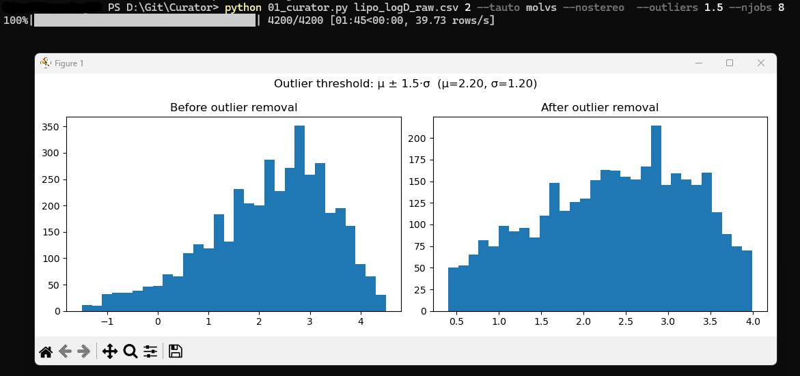
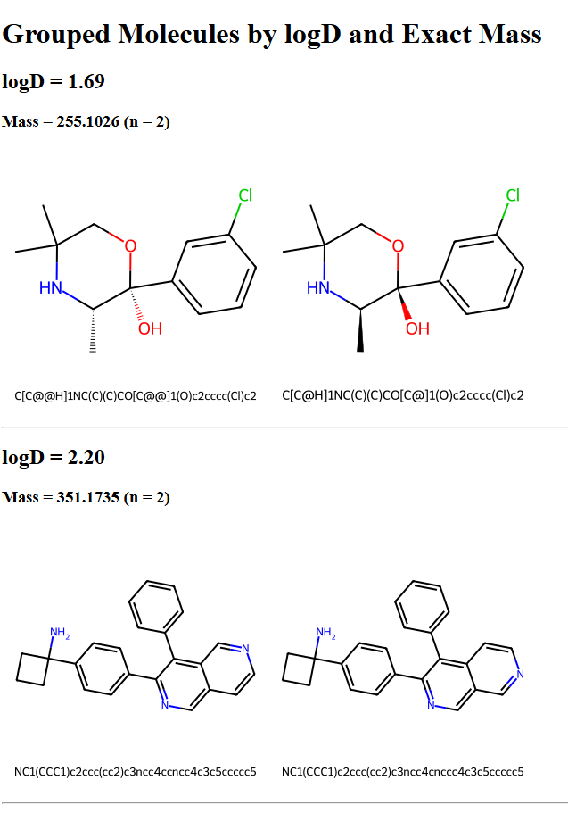

# Curator

**Curator** is a two-script toolkit for preparing raw structural data for machine learning and deep learning applications. Input files must contain molecular structures in SMILES format and a corresponding numerical property (e.g., logP, logD).

---
## 01_curator.py

The first script, `01_curator.py`, removes structural duplicates based on molecular identity - not by comparing SMILES strings directly, but by converting them into molecular objects and comparing their standardized representations. Optional filters include the removal of stereoisomers, tautomers, outliers, and structurally similar compounds using a configurable Tanimoto similarity threshold.

Outlier removal is based on a simple statistical rule: the script calculates the mean and standard deviation of the selected numeric column (default: third column), and excludes all values outside the range defined by μ ± k·σ, where μ is the mean, σ the standard deviation, and k is a user-specified multiplier (typically 1.5). This allows for flexible trimming of extreme values in noisy datasets.

When outlier filtering is enabled, the script also generates two histograms for visual inspection: before and after filtering. This process is particularly useful when preparing large datasets for modeling by reducing redundancy and statistical noise.

<p align="center"></p>

---

## 02_grouper.py

The second `script, 02_grouper.py`, is intended for visual inspection of the dataset after curation. 

It groups compounds by exact property values (e.g., all compounds with logP = 2.45), then further splits each group by molecular weight. If any weight-based group contains more than one compound, it is flagged for visualization—potentially indicating unresolved isomers or tautomers. 

The script generates an HTML summary that displays the property-based and mass-based groupings, along with rendered chemical structures and their corresponding SMILES codes. This helps identify residual structural redundancies that may have passed through the initial filtering.

<p align="center"></p>

---

## Installation & Requirements

### Required:
- Python 3.7+
- [Open Babel](http://openbabel.org/)
- [RDKit](https://www.rdkit.org/)

### Optional (recommended):
- `molvs` (tautomer standardization)
- `tqdm` (progress bars)
- `matplotlib` (histograms)

Install missing packages with:
```bash
pip install molvs tqdm matplotlib
```

### Option 2: Conda

If you prefer Conda, use the provided environment.yml to create an environment named data_curator:

```bash
conda env create -f environment.yml -n data_curator
conda activate data_curator
```

---

# 01_curator.py

## How to Run 

You can run the script from the command line using:

```bash
python 01_curator.py input.csv 2 --tauto strong --nostereo --tanimoto-thres 0.95 --outliers 1.5 --njobs 4
```

This example performs:
- Deduplication based on InChIKey with stereochemistry removed
- Tautomer handling using RDKit
- Fuzzy duplicate removal using a Tanimoto similarity threshold of 0.95 (ECFP4 fingerprints)
- Outlier trimming based on the third column (default) using μ ± 1.5·σ
- Parallel processing with 4 worker processes

## Output Files

After processing, the script generates two output files:

- `yourfile_singled.csv` — the curated dataset with duplicates, outliers, and invalid entries removed.
- `yourfile_rejects.csv` — a log of all discarded rows, each tagged with a reason such as `Duplicate`, `ParseError`, `IndexError`, `FPError`, `Tanimoto`, `Outlier`, or `ValueError`.

---

## ⚙️ CLI Options

| Argument             | Type / Values                      | Description                                                                 |
|----------------------|------------------------------------|-----------------------------------------------------------------------------|
| `csv_file`           | str                                | Path to the input CSV file. Must include SMILES and a numeric value.       |
| `smiles_col`         | int                                | 1-based index of the column containing SMILES strings.                     |
| `--tauto`            | `off`, `weak`, `strong`, `molvs`   | Tautomer canonicalization method: <br>• `off`: skip <br>• `weak`: Open Babel <br>• `strong`: RDKit <br>• `molvs`: MolVS |
| `--nostereo`         | flag                               | If set, removes stereochemistry (merges stereoisomers).                    |
| `--tanimoto-thres`   | float                              | Optional fuzzy filter. Removes compounds with Tanimoto similarity ≥ threshold. |
| `--outliers`         | float                              | Remove numeric outliers in column 3 using μ ± *K*·σ, where *K* is the value you provide. |
| `--njobs`            | int                                | Number of parallel worker processes (default: 1).                          |
| `--quiet`            | flag                               | Suppress RDKit and logging output.                                         |

---

# 02_grouper.py

## How to Run

To launch the grouping and visualization tool, use the following command:

```bash
python 02_grouper.py 'molecules_singled.csv' 'logP' --output_html grouped_output.html --img_dir img
```

This example:
- Loads the curated CSV file `molecules_singled.csv`
- Groups molecules by identical `logP` values
- Subdivides each group by exact molecular mass (to 4 decimal places)
- Generates an HTML report with molecule images
- Saves output images to the `img/` directory

---

## CLI Options

| Argument         | Required | Default                                | Description                                                                 |
|------------------|----------|----------------------------------------|-----------------------------------------------------------------------------|
| `csv_path`       | Yes      | –                                      | Path to input CSV file containing SMILES and a numeric label.              |
| `label_column`   | Yes      | –                                      | Column name used for grouping (e.g., `logP`, `logD`, etc.).                |
| `--output_html`  | No       | `grouped_output.html`                  | Name of the output HTML file.                                              |
| `--img_dir`      | No       | `img`                                  | Folder where molecule images will be saved.                                |

---

## Output Files

After execution, the script produces:

- `grouped_output.html` — an interactive HTML report showing molecules grouped by property and molecular mass, including their structures and SMILES.
- `img/` — a directory containing PNG images of molecule grids, organized by property and mass group.


